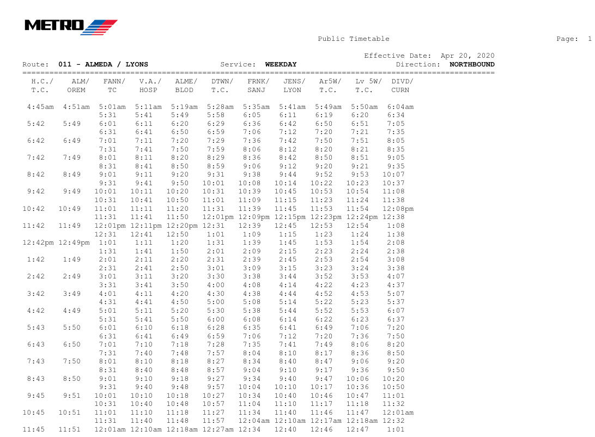
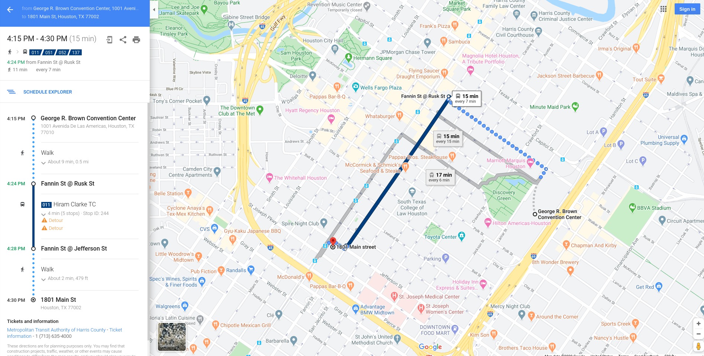

# Welcome

## American Planning Association

planning.org

--------

## About APA

The American Planning Association provides leadership in the development of vital communities by advocating excellence in planning, promoting education and citizen empowerment, and providing our members with the tools and support necessary to meet the challenges of growth and change.

## APA Team Members

- Cory Mollet
  - Lead Developer
- Randall West
  - Manager of Web and Application Development

## Sketch City

# Data Jam

## What is That?

- similar to a Hackathon
- an intensive workshop where volunteers explore problems using open data, technology, and design
- focus is more on exploratory data analysis than building an MVP in a weekend

## What are we Doing?

- any planning data-related thing you want, really
  - housing
  - equity
  - transportation
  - land use
  - economic development
  - etc.
- but we have selected one central theme

# Metadata for Planning Documents

## Types of Planning Documents

- Comprehensive Plans
- Functional Plans
- Subarea Plans
- Corridor Plans
- Complete Streets Plans
- Hazard Mitigation and Disaster Recovery Plans
- Arts and Culture Plans
- and many more!

-----

- Even plans with "limited" scope typically involve an enormous amount of work that require collaboration among multiple organizations
  - data collection, cleaning, analyzing, visualizing
  - stakeholder engagement
  - drafting, editing, tracking changes, soliciting feedback and comments, publishing

## And when it's finally "done", we get...

- printed volumes, which aren't cheap to print in large quantities
  - that usually end up collecting dust on a shelf in some windowless basement room somewhere
- gigantic PDFs, links to which can be hard to find and/or 404 after a while

----

<a href="https://www.flickr.com/photos/fornal/420469323/">"Woody's One Way"</a> by <a href="https://www.flickr.com/people/fornal/">Robert Fornal</a> is licensed under <a href="https://creativecommons.org/licenses/by-nc-sa/2.0/?ref=ccsearch&atype=html" style="margin-right: 5px;">CC BY-NC-SA 2.0</a>

## So much work goes in to creating documents that end up being far less useful than they could be

## What if someone wanted to...

- Find corridor plans that mention bicycle infrastructure in cities between 50k-250k in population published in the last 20 years?
- List the quantifiable attributes of recommendations from a hazard mitigation plan that were implemented in areas before a disaster struck to evaluate their effectiveness after the disaster struck?

-----

- Find plans that include the topics of sprawl, infill development, and farmland preservation in specific geographic areas, then compare before-and-after satellite photos of those areas?

*These would all be extremely tedious and time-consuming to do currently*

# Similar Precendents

## GTFS

- [General Transit Feed Specification](https://developers.google.com/transit/gtfs/)
  - the "G" used to stand for Google, because they needed a machine-readable format of transit routes and schedules for use in Google Maps
  - so they created a standard format to allow transit agencies to self-publish their routes and schedules to enable transit directions on Google Maps

----

-----

